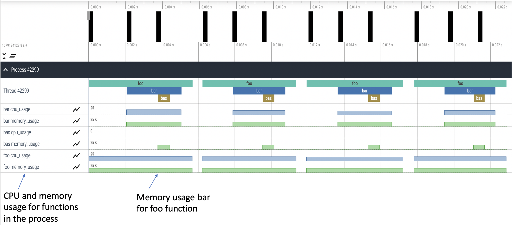

..
   # Copyright 2021 Lawrence Livermore National Security, LLC and other
   # PerfFlowAspect Project Developers. See the top-level LICENSE file for
   # details.
   #
   # SPDX-License-Identifier: LGPL-3.0

################
 Basic Tutorial
################

PerfFlowAspect is based on Aspect-Oriented Programming (AOP). Some common terms
used in AOP are described below.

-  **Join Points**: A point in a program's execution in which the behavior can
   be modified by AOP. The candidate points are method invocations.

-  **Pointcuts**: An expression used to match join points (creating a set of
   join points), allows you to specify to AOP where and when in the code to make
   modifications.

-  **Advice**: Defines the additional behavior or action that will be inserted
   into the code, specifically at each join point matched by the pointcut.

-  **Aspect**: The collection of the pointcut expression and the advice.

-  **Weaver**: Applies aspects into the code, modifying code at join points with
   matching pointcuts and associated advices. The combining of aspects and code
   enables execution of cross-cutting concerns.

PerfFlowAspect relies on annotated functions in the user's source code and can
invoke specific performance-analysis actions, a piece of tracing code, etc. on
those points of execution. In AOP, these trigger points are called join points
in the source code, and the functionality invoked is called advice.

The python package ``perfflowaspect`` contains the PerfFlowAspect tool for the
Python language. The file ``src/python/perfflowaspect/aspect.py`` contains a key
annotating decorator. Users can use the
``@perfflowaspect.aspect.critical_path()`` decorator to annotate their functions
that are likely to be on the critical path of the workflow's end-to-end
performance. These annotated functions then serve as the join points that can be
weaved with PerfFlowAspect to be acted upon.

The following shows a simple snippet that annotates two functions.

.. code:: python

   import perfflowaspect.aspect

   @perfflowaspect.aspect.critical_path()
   def bar(message):
       time.sleep(1)
       print(message)

   @perfflowaspect.aspect.critical_path()
   def foo():
       time.sleep(2)
       bar("hello")

   def main():
       foo()

Once annotated, running this python code will produce a performance trace data
file named ``perfflow.<hostname>.<pid>``. It uses Chrome Tracing Format in JSON
so that it can be loaded into Google Chrome Tracing to render the critical path
events on the global tracing timeline, using the Perfetto visualization tool.
Details on these can be found at the links below:

-  **Chrome Tracing Tool:**
   https://www.chromium.org/developers/how-tos/trace-event-profiling-tool/
-  **Perfetto Visualizer:** https://perfetto.dev/

To disable all PerfFlowAspect annotations, set the
``PERFFLOW_OPTIONS="log-enable="`` to ``False`` at runtime.

.. code:: bash

   PERFFLOW_OPTIONS="log-enable=False" ./test/smoketest.py

**********************************************
 Visualization of PerfFlowAspect Output Files
**********************************************

There are two types of logging allowed in PerfFlowAspect trace files which are
``verbose`` and ``compact``. Either can be anabled by setting
``PERFFLOW_OPTIONS="log-event="`` to ``compact`` or ``verbose`` respectively.
``Verbose`` logging uses B (begin) and E (end) events in the trace file as shown
below:

.. code:: JSON

   [
   {"name": "foo", "cat": "/PerfFlowAspect/src/c/test/smoketest.cpp", "pid": 3134, "tid": 3134, "ts": 1679127184455376.0, "ph": "B"},
   {"name": "bar", "cat": "/PerfFlowAspect/src/c/test/smoketest.cpp", "pid": 3134, "tid": 3134, "ts": 1679127184456525.0, "ph": "B"},
   {"name": "bas", "cat": "/PerfFlowAspect/src/c/test/smoketest.cpp", "pid": 3134, "tid": 3134, "ts": 1679127184457610.0, "ph": "B"},
   {"name": "bas", "cat": "/PerfFlowAspect/src/c/test/smoketest.cpp", "pid": 3134, "tid": 3134, "ts": 1679127184457636.0, "ph": "E"},
   {"name": "bar", "cat": "/PerfFlowAspect/src/c/test/smoketest.cpp", "pid": 3134, "tid": 3134, "ts": 1679127184457657.0, "ph": "E"},
   {"name": "foo", "cat": "/PerfFlowAspect/src/c/test/smoketest.cpp", "pid": 3134, "tid": 3134, "ts": 1679127184457676.0, "ph": "E"},

The above trace file is generated for three functions with ``around`` pointcut
annotations. The same trace file will be reduced to half the lines with
``compact`` logging which uses X (complete) events, as can be seen below:

.. code:: JSON

   [
   {"name": "bas", "cat": "/PerfFlowAspect/src/c/test/smoketest.cpp", "pid": 2688, "tid": 2688, "ts": 1679127137181517.0, "ph": "X", "dur": 600.0},
   {"name": "bar", "cat": "/PerfFlowAspect/src/c/test/smoketest.cpp", "pid": 2688, "tid": 2688, "ts": 1679127137179879.0, "ph": "X", "dur": 2885.0},
   {"name": "foo", "cat": "/PerfFlowAspect/src/c/test/smoketest.cpp", "pid": 2688, "tid": 2688, "ts": 1679127137177783.0, "ph": "X", "dur": 5532.0},

The visualization of both types of logging in trace files will be the same in
Perfetto UI. An example visualization is shown below:

.. figure:: images/vis1.png
   :align: center

   Fig. 1: Visualization of a single process, single thread program in Perfetto UI

The visualization in Fig. 1 is of the following python program:

.. code:: python

   #!/usr/bin/env python

   import time
   import perfflowaspect
   import perfflowaspect.aspect

   @perfflowaspect.aspect.critical_path(pointcut="around")
   def bas():
      print("bas")

   @perfflowaspect.aspect.critical_path(pointcut="around")
   def bar():
      print("bar")
      time.sleep(0.001)
      bas()

   @perfflowaspect.aspect.critical_path()
   def foo(msg):
      print("foo")
      time.sleep(0.001)
      bar()
      if msg == "hello":
         return 1
      return 0

   def main():
      print("Inside main")
      for i in range(4):
         foo("hello")
      return 0

   if __name__ == "__main__":
      main()

Now, PerfFlowAspect also allows the user to log CPU and memory usage of
annotated functions by setting ``PERFFLOW_OPTIONS="cpu-mem-usage="`` to ``True``
at runtime. The trace file, in that case, will have the following structure with
``compact`` logging enabled:

.. code:: JSON

   [
   {"name": "bas", "cat": "/PerfFlowAspect/src/c/test/smoketest3.cpp", "pid": 44479, "tid": 44479, "ts": 1679184351167907.0, "ph": "C", "args": {"cpu_usage": 0.0, "memory_usage": 10944}},
   {"name": "bas", "cat": "/PerfFlowAspect/src/c/test/smoketest3.cpp", "pid": 44479, "tid": 44479, "ts": 1679184351168628.0, "ph": "C", "args": {"cpu_usage": 0.0, "memory_usage": 0}},
   {"name": "bas", "cat": "/PerfFlowAspect/src/c/test/smoketest3.cpp", "pid": 44479, "tid": 44479, "ts": 1679184351167907.0, "ph": "X", "dur": 721.0},
   {"name": "bar", "cat": "/PerfFlowAspect/src/c/test/smoketest3.cpp", "pid": 44479, "tid": 44479, "ts": 1679184351167127.0, "ph": "C", "args": {"cpu_usage": 11.980575694383594, "memory_usage": 10944}},
   {"name": "bar", "cat": "/PerfFlowAspect/src/c/test/smoketest3.cpp", "pid": 44479, "tid": 44479, "ts": 1679184351170287.0, "ph": "C", "args": {"cpu_usage": 0.0, "memory_usage": 0}},
   {"name": "bar", "cat": "/PerfFlowAspect/src/c/test/smoketest3.cpp", "pid": 44479, "tid": 44479, "ts": 1679184351167127.0, "ph": "X", "dur": 3160.0},
   {"name": "foo", "cat": "/PerfFlowAspect/src/c/test/smoketest3.cpp", "pid": 44479, "tid": 44479, "ts": 1679184351165193.0, "ph": "C", "args": {"cpu_usage": 98.625834450525915, "memory_usage": 14976}},
   {"name": "foo", "cat": "/PerfFlowAspect/src/c/test/smoketest3.cpp", "pid": 44479, "tid": 44479, "ts": 1679184351505085.0, "ph": "C", "args": {"cpu_usage": 0.0, "memory_usage": 0}},
   {"name": "foo", "cat": "/PerfFlowAspect/src/c/test/smoketest3.cpp", "pid": 44479, "tid": 44479, "ts": 1679184351165193.0, "ph": "X", "dur": 339892.0},

Following is the visualization for the python program above with CPU and memory
usage loggin enabled:

   Fig. 2: Visualization of a single process, single thread program with CPU and memory usage
