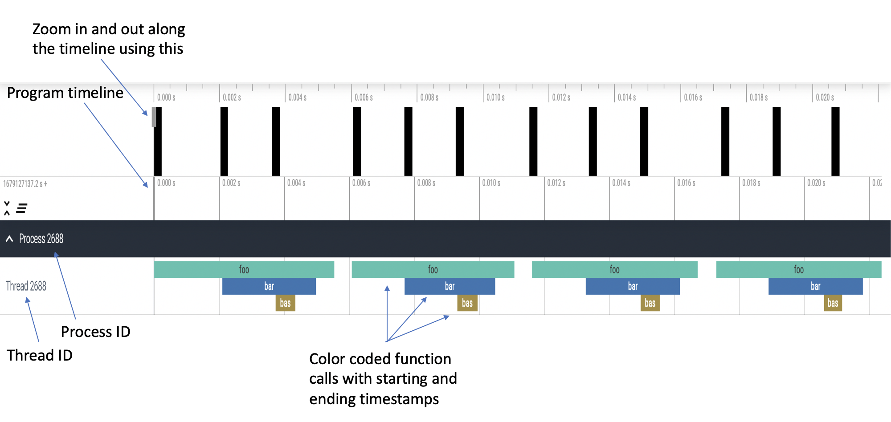

..
   # Copyright 2021 Lawrence Livermore National Security, LLC and other
   # PerfFlowAspect Project Developers. See the top-level LICENSE file for
   # details.
   #
   # SPDX-License-Identifier: LGPL-3.0

##############################################
 Visualization of PerfFlowAspect Output Files
##############################################

There are two types of logging allowed in PerfFlowAspect trace files which are
``verbose`` and ``compact``. ``Verbose`` logging uses B (begin) and E (end)
events in the trace file as shown below:

.. code:: JSON

   [
   {"name": "foo", "cat": "/PerfFlowAspect/src/c/test/smoketest.cpp", "pid": 3134, "tid": 3134, "ts": 1679127184455376.0, "ph": "B"},
   {"name": "bar", "cat": "/PerfFlowAspect/src/c/test/smoketest.cpp", "pid": 3134, "tid": 3134, "ts": 1679127184456525.0, "ph": "B"},
   {"name": "bas", "cat": "/PerfFlowAspect/src/c/test/smoketest.cpp", "pid": 3134, "tid": 3134, "ts": 1679127184457610.0, "ph": "B"},
   {"name": "bas", "cat": "/PerfFlowAspect/src/c/test/smoketest.cpp", "pid": 3134, "tid": 3134, "ts": 1679127184457636.0, "ph": "E"},
   {"name": "bar", "cat": "/PerfFlowAspect/src/c/test/smoketest.cpp", "pid": 3134, "tid": 3134, "ts": 1679127184457657.0, "ph": "E"},
   {"name": "foo", "cat": "/PerfFlowAspect/src/c/test/smoketest.cpp", "pid": 3134, "tid": 3134, "ts": 1679127184457676.0, "ph": "E"},

The above trace file is generated for three functions with ``around`` pointcut
annotations. The same trace file will be reduced to half the lines with
``compact`` logging, as can be seen below:

.. code:: JSON

   [
   {"name": "bas", "cat": "/PerfFlowAspect/src/c/test/smoketest.cpp", "pid": 2688, "tid": 2688, "ts": 1679127137181517.0, "ph": "X", "dur": 600.0},
   {"name": "bar", "cat": "/PerfFlowAspect/src/c/test/smoketest.cpp", "pid": 2688, "tid": 2688, "ts": 1679127137179879.0, "ph": "X", "dur": 2885.0},
   {"name": "foo", "cat": "/PerfFlowAspect/src/c/test/smoketest.cpp", "pid": 2688, "tid": 2688, "ts": 1679127137177783.0, "ph": "X", "dur": 5532.0},

The visualization of both types of logging in trace files will be the same in
Perfetto UI. An example visualization is shown below:

   Fig. 1: Visualization of a single process, single thread program in Perfetto UI

The visualization in Fig. 1 is of the following python program:

.. code:: python

   #!/usr/bin/env python

   import time
   import perfflowaspect
   import perfflowaspect.aspect

   @perfflowaspect.aspect.critical_path(pointcut="around")
   def bas():
      print("bas")

   @perfflowaspect.aspect.critical_path(pointcut="around")
   def bar():
      print("bar")
      time.sleep(0.001)
      bas()

   @perfflowaspect.aspect.critical_path()
   def foo(msg):
      print("foo")
      time.sleep(0.001)
      bar()
      if msg == "hello":
         return 1
      return 0

   def main():
      print("Inside main")
      for i in range(4):
         foo("hello")
      return 0

   if __name__ == "__main__":
      main()
